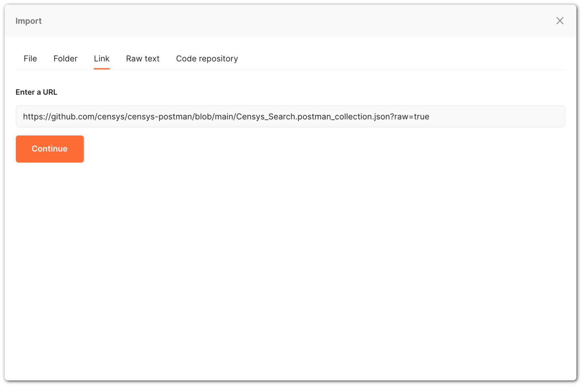
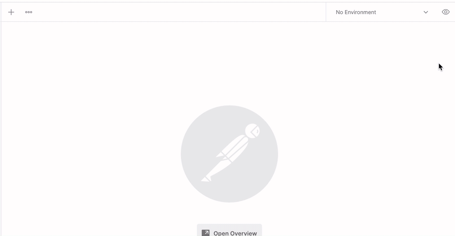

# Censys Postman

Postman collections for the Censys Search APIs ([search.censys.io](https://search.censys.io/)) and Censys Attack Surface Management APIs ([app.censys.io](https://app.censys.io))

## Usage

The Postman Collections in this repo are JSON files containing information about the API calls available from Censys Search and Censys ASM. With these collections, you can use Postman to easily test and develop around Censys' APIs.

### Import Collections

To use these Collections, import them into the Postman app. Postman offers several options for import. Click the **Import** button in the Postman app and choose one of the options in the modal:

- Connect to this code repository through Postman
- Copy the URL of the raw files in this repo
- Copy and paste the raw text of the Collection files into the modal

### Set Up an Environment to Populate Collection Variables

The Censys Collections contain calls that reference variables, particularly API credentials, which are required to authenticate every call. You can specify variables in a Postman Environment to reuse across calls.

#### Censys Search

Create a Censys Search Environment and add the following two variables as keys:

- `CENSYS_API_ID`
- `CENSYS_API_SECRET`

Retrieve the values for these variables on the [Censys account](https://search.censys.io/account/api) page of the Search app. If you don't have an account, please [sign up for a free account](https://search.censys.io/register) or [contact Censys sales](https://censys.io/contact-sales).

#### Censys ASM

Create a Censys ASM environment and add the following variable as a key:

- `censysApiKey`

Retrieve the value for your Censys ASM API key from the [Integrations page](https://app.censys.io/integrations) of the Attack Surface Management web app and add it to the environment.

## Resources

- [Censys Homepage](https://censys.io/)
- [Censys Search API Docs](https://search.censys.io/api)
- [Censys ASM API Docs](https://app.censys.io/api-docs)
- [Issue Tracker](https://github.com/censys/censys-postman/issues)
- [Postman Documentation](https://learning.postman.com/docs/)
- [Postman Environments](https://learning.postman.com/docs/sending-requests/managing-environments/)

## Contributing

All contributions (no matter how small) are always welcome.

## Authors

- Jose Nazario (@jnazarioCensys)
- Aidan Holland (@thehappydinoa)
- Jessica (@jpsinnott)

## License

This software is licensed under [Apache License, Version 2.0](http://www.apache.org/licenses/LICENSE-2.0)

- Copyright (C) 2021 Censys, Inc.
